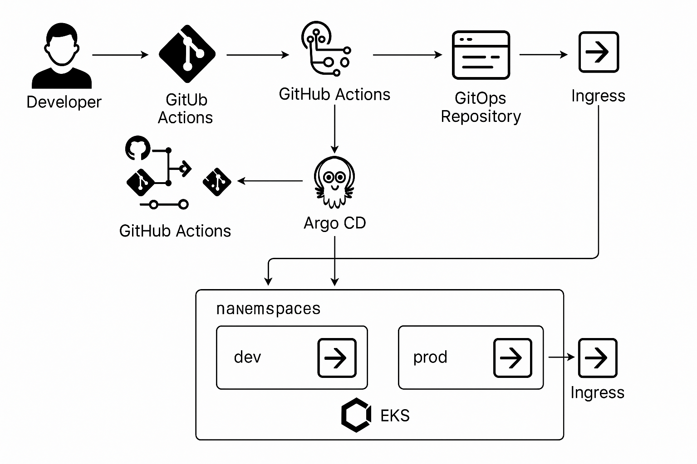

# Project 3 Architecture



This document explains the architecture of Project 3, which implements a complete
CI → GitOps → Argo CD → EKS deployment pipeline. It describes how application
images are built, how Kubernetes manifests are updated, and how Argo CD keeps
the cluster synchronized with the GitOps repository.

---

# 1. High-Level Architecture Overview

```
Developer → GitHub (Project 1) → ECR → GitOps Repo (Project 3) → Argo CD → EKS
```

### Components

- **Project 1: Application Repository**
  - Contains the application source code and Dockerfile.
  - GitHub Actions builds images and pushes them to Amazon ECR.
  - On the `project3-gitops` branch, the workflow updates the Project 3 GitOps repo.

- **Amazon ECR**
  - Stores versioned container images, tagged with Git commit SHAs.

- **Project 3: GitOps Repository (project3-app-config)**
  - Stores Kubernetes manifests using `base` + `overlays/dev` + `overlays/prod`.
  - Dev updates happen automatically via CI.
  - Prod updates happen manually by editing the prod overlay.

- **Argo CD**
  - Watches Project 3's GitOps repository.
  - Automatically syncs the dev overlay into the `project3-dev` namespace.
  - Automatically syncs the prod overlay into the `project3-prod` namespace.
  - Pull-based, declarative deployment model.

- **Amazon EKS**
  - Hosts two isolated Kubernetes namespaces:
    - `project3-dev`
    - `project3-prod`

---

# 2. Detailed Architecture Flow

## 2.1 Developer Workflow (Project 1)

1. Developer commits changes to the `project3-gitops` branch of Project 1.
2. GitHub Actions:
   - Builds a new Docker image.
   - Pushes the image to Amazon ECR using the SHA tag.
   - Updates the Project 3 GitOps repository (`overlays/dev/kustomization.yaml`).

This completes the CI portion of the pipeline.

---

## 2.2 GitOps Repository Behavior (Project 3)

The GitOps repo uses the following structure:

```
project3-app-config/
├── apps/
│   ├── project3-dev-app.yaml
│   └── project3-prod-app.yaml
├── base/
│   ├── deployment.yaml
│   ├── service.yaml
│   ├── ingress.yaml
│   ├── hpa.yaml
│   └── kustomization.yaml
└── overlays/
    ├── dev/
    │   ├── kustomization.yaml
    │   ├── ingress-dev-patch.yaml
    │   └── namespace-dev.yaml
    └── prod/
        ├── kustomization.yaml
        └── namespace-prod.yaml
```

### Base
- Shared manifests for Deployment, Service, Ingress, and HPA.

### Dev Overlay
- Deploys to `project3-dev`.
- Image tag automatically updated by CI.
- Argo CD syncs continuously.

### Prod Overlay
- Deploys to `project3-prod`.
- Image tag updated **manually** for controlled promotion.
- Argo CD syncs whenever a commit changes the overlay.

---

# 3. Argo CD Architecture

## 3.1 Application Definitions

Argo CD uses two Application manifests:

```
apps/project3-dev-app.yaml
apps/project3-prod-app.yaml
```

### Dev Application
- Watches `overlays/dev`
- Target namespace: `project3-dev`
- Auto-sync enabled
- Prune + self-heal enabled

### Prod Application
- Watches `overlays/prod`
- Target namespace: `project3-prod`
- Auto-sync enabled
- Manual promotion triggers updates

---

# 4. Deployment Path Comparison

## Dev Environment (Automated)
- New commit in Project 1 triggers CI.
- CI builds a new image and pushes to ECR.
- CI updates dev overlay in GitOps repo.
- Argo CD detects change and syncs it.
- New pods deploy in `project3-dev`.

## Prod Environment (Manual Promotion)
- Dev stabilization is verified.
- Developer updates `overlays/prod/kustomization.yaml` with the desired image tag.
- Commit → push.
- Argo CD syncs prod and deploys the promoted image.

---

# 5. Why GitOps?

GitOps provides:

- Declarative infrastructure and deployment state in Git.
- Automatic synchronization via Argo CD.
- Complete audit trail for cluster changes.
- Clear separation of dev (auto) and prod (manual).

This model aligns with real-world DevOps practices for Kubernetes-based systems.

---

# 6. Next Steps

- Document IRSA and OIDC configuration (`docs/oidc-irsa.md`).
- Document Argo CD installation (`docs/argo-setup.md`).
- Add a deployment flow diagram (`docs/deployment-flow.md`).
- Add a Load Balancer Controller guide (`docs/load-balancer-controller.md`).

